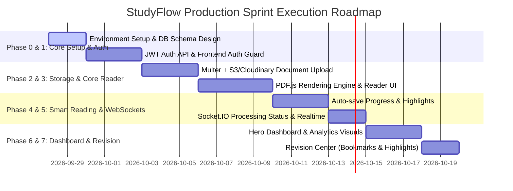

# 🚀 StudyFlow — Master Architecture, System Design & Production Roadmap

> **Upload. Read. Continue. Revise.**
> *A Production-Ready, Distraction-Free Personal Study & Document Workspace.*

---

## 📋 Executive Summary & Product Vision

**StudyFlow** solves a fundamental problem for modern learners: scattered study materials across PDFs, Word documents, ChatGPT notes, and web articles without a unified, smart tracking system. 

Instead of acting as just another generic PDF viewer or a basic notes application, **StudyFlow is an immersive, distraction-free study workspace** that preserves original document fidelity while offering reflowed reading, real-time progress tracking, inline highlighting, contextual note-taking, and automated revision scheduling.

---

## 📐 1. Architectural Blueprint & High-Level System Design

```mermaid
graph TD
    subgraph Client Layer [Frontend - React + Vite + Tailwind]
        UI[UI Components / Framer Motion]
        PDFEngine[PDF.js Rendering Engine]
        StudyEngine[Reflowed HTML Reader]
        SocketClient[Socket.IO Client]
        AuthContext[Auth & User Context]
    end

    subgraph API Gateway / Middleware
        CORS[CORS / Helmet / Security]
        RateLimiter[Express Rate Limiter]
        AuthJWT[JWT Authentication Guard]
    end

    subgraph Backend Layer [Node.js + Express Server]
        AuthCtrl[Auth Controller]
        DocCtrl[Document & Processing Controller]
        ProgressCtrl[Debounced Progress Controller]
        NoteCtrl[Bookmarks & Highlights Controller]
        SocketHandler[Socket.IO Gateway Engine]
    end

    subgraph Processing Pipeline
        MulterUpload[Multer File Ingestion]
        DocProcessor[PDF/TXT Extractor & Reflower]
    end

    subgraph Persistence & Cloud Storage
        MongoDB[(MongoDB Database)]
        CloudStorage[Cloudinary / AWS S3 Storage]
    end

    UI --> AuthContext
    UI --> PDFEngine
    UI --> StudyEngine
    UI --> SocketClient

    Client Layer -->|HTTP/REST APIs| API Gateway
    SocketClient <-->|WebSocket Connection| SocketHandler

    API Gateway --> AuthCtrl
    API Gateway --> DocCtrl
    API Gateway --> ProgressCtrl
    API Gateway --> NoteCtrl

    DocCtrl --> MulterUpload
    MulterUpload --> DocProcessor
    DocProcessor --> CloudStorage
    DocProcessor --> MongoDB

    AuthCtrl --> MongoDB
    ProgressCtrl --> MongoDB
    NoteCtrl --> MongoDB
```

---

## 🎨 2. Design System & Responsive Layout Strategy

### Visual Identity Philosophy
- **Dark-First Core**: Sleek dark slate (`#0B0F17`) background with soft ambient glow, subtle borders (`rgba(255,255,255,0.08)`), and high-contrast typography.
- **Light Theme Support**: Warm paper theme (`#F8F9FA`) optimized for long reading sessions.
- **Glassmorphism & Depth**: Multi-layered backdrop blurs (`backdrop-blur-md`) reserved exclusively for floating action bars, headers, and modal overlays.
- **Typography**: Inter / Outfit for UI controls; Lora / Newsreader for long-form reading comfort.
- **Micro-Interactions**: Framer Motion tab transitions, subtle hover elevations, and active page progress ring animations.

### Responsive Layout Boundaries

| Device Category | Breakpoint Range | Key Layout Adaptations |
| :--- | :--- | :--- |
| **Mobile Portrait** | `360px` – `480px` | Single-column reflow, bottom sheet navigation drawer, floating quick tool action bar, touch-swipe reader mode. |
| **Mobile Landscape / Tablet** | `481px` – `768px` | Adaptive 2-column drawer layout, collapsible TOC header bar, simplified reader controls. |
| **Laptop / Desktop** | `769px` – `1440px` | 3-pane split view (TOC Sidebar | Primary Canvas Engine | Contextual Highlights & Notes Panel). |
| **Ultra-Wide** | `1440px+` | Max-width bounded canvas (`1200px` centered) to maintain comfortable reading line lengths (65–75 characters per line). |

---

## 🗃️ 3. Complete MongoDB Database Schema Specification

### 3.1 `User` Schema
```javascript
const UserSchema = new mongoose.Schema({
  name: { type: String, required: true, trim: true },
  email: { type: String, required: true, unique: true, lowercase: true, trim: true },
  password: { type: String, required: true, select: false },
  avatar: { type: String, default: "" },
  preferences: {
    theme: { type: String, enum: ["dark", "light", "sepia"], default: "dark" },
    readerFontSize: { type: Number, default: 16 },
    readerLineHeight: { type: Number, default: 1.6 },
    autoSaveIntervalMs: { type: Number, default: 3000 }
  },
  readingStats: {
    totalReadingTimeMinutes: { type: Number, default: 0 },
    documentsCompleted: { type: Number, default: 0 },
    currentStreakDays: { type: Number, default: 0 },
    lastActiveDate: { type: Date, default: Date.now }
  }
}, { timestamps: true });
```

### 3.2 `Subject` Schema
```javascript
const SubjectSchema = new mongoose.Schema({
  userId: { type: mongoose.Schema.Types.ObjectId, ref: "User", required: true, index: true },
  name: { type: String, required: true, trim: true },
  color: { type: String, default: "#6366F1" }, // Accent HEX code
  icon: { type: String, default: "book" },
  description: { type: String, default: "" },
  isArchived: { type: Boolean, default: false }
}, { timestamps: true });
```

### 3.3 `Document` Schema
```javascript
const DocumentSchema = new mongoose.Schema({
  userId: { type: mongoose.Schema.Types.ObjectId, ref: "User", required: true, index: true },
  subjectId: { type: mongoose.Schema.Types.ObjectId, ref: "Subject", required: true, index: true },
  title: { type: String, required: true, trim: true },
  fileUrl: { type: String, required: true },
  filePublicId: { type: String }, // Cloudinary / S3 Key
  fileType: { type: String, enum: ["pdf", "txt", "docx", "md"], required: true },
  fileSizeBytes: { type: Number, required: true },
  totalPages: { type: Number, default: 1 },
  processingStatus: { 
    type: String, 
    enum: ["pending", "processing", "ready", "failed"], 
    default: "pending",
    index: true 
  },
  processingProgress: { type: Number, default: 0 }, // 0 to 100%
  extractedContent: [{
    pageNumber: Number,
    heading: String,
    rawText: String,
    formattedHtml: String
  }],
  toc: [{
    title: String,
    pageNumber: Number,
    level: Number
  }]
}, { timestamps: true });
```

### 3.4 `ReadingProgress` Schema
```javascript
const ReadingProgressSchema = new mongoose.Schema({
  userId: { type: mongoose.Schema.Types.ObjectId, ref: "User", required: true, index: true },
  documentId: { type: mongoose.Schema.Types.ObjectId, ref: "Document", required: true, index: true },
  currentPage: { type: Number, default: 1 },
  scrollPositionRatio: { type: Number, default: 0 }, // Vertical scroll ratio (0.0 - 1.0)
  currentChapterTitle: { type: String, default: "" },
  completionPercentage: { type: Number, default: 0, min: 0, max: 100 },
  lastReadAt: { type: Date, default: Date.now },
  totalTimeSpentSeconds: { type: Number, default: 0 }
}, { timestamps: true });

ReadingProgressSchema.index({ userId: 1, documentId: 1 }, { unique: true });
```

### 3.5 `Bookmark` Schema
```javascript
const BookmarkSchema = new mongoose.Schema({
  userId: { type: mongoose.Schema.Types.ObjectId, ref: "User", required: true, index: true },
  documentId: { type: mongoose.Schema.Types.ObjectId, ref: "Document", required: true, index: true },
  pageNumber: { type: Number, required: true },
  title: { type: String, required: true },
  noteSnippet: { type: String, default: "" },
  color: { type: String, default: "#F59E0B" }
}, { timestamps: true });
```

### 3.6 `Highlight` Schema
```javascript
const HighlightSchema = new mongoose.Schema({
  userId: { type: mongoose.Schema.Types.ObjectId, ref: "User", required: true, index: true },
  documentId: { type: mongoose.Schema.Types.ObjectId, ref: "Document", required: true, index: true },
  pageNumber: { type: Number, required: true },
  selectedText: { type: String, required: true },
  rangeSelector: {
    startOffset: Number,
    endOffset: Number,
    startContainerPath: String,
    endContainerPath: String
  },
  color: { type: String, enum: ["yellow", "green", "blue", "pink"], default: "yellow" },
  noteText: { type: String, default: "" }
}, { timestamps: true });
```

### 3.7 `Note` Schema
```javascript
const NoteSchema = new mongoose.Schema({
  userId: { type: mongoose.Schema.Types.ObjectId, ref: "User", required: true, index: true },
  documentId: { type: mongoose.Schema.Types.ObjectId, ref: "Document", required: true, index: true },
  pageNumber: { type: Number, default: 1 },
  title: { type: String, default: "Untitled Note" },
  content: { type: String, required: true },
  tags: [{ type: String }]
}, { timestamps: true });
```

---

## 🔌 4. API Specification & Real-Time Socket Architecture

### 4.1 Integration Protocol Split Matrix

| Action / Operation | Protocol | Rationale |
| :--- | :--- | :--- |
| Auth, User Profile & Settings | `REST (HTTPS)` | Standard stateless HTTP requests with JWT tokens. |
| CRUD Documents & File Upload | `REST (Multipart/Form)` | Standard HTTP stream handling via Multer middleware. |
| Create/Edit Bookmarks & Notes | `REST (HTTPS)` | Transactional mutations with deterministic HTTP responses. |
| Debounced Auto-Save Progress | `REST (HTTPS)` | High-frequency update safely debounced on frontend (3000ms delay). |
| Real-Time Doc Processing Status | `WebSocket (Socket.IO)` | Live percentage updates (`0% -> 100%`) without client polling. |
| Reading Session Heartbeat | `WebSocket (Socket.IO)` | Tracks active study time seamlessly when document is open. |

### 4.2 Primary REST Endpoints Architecture

```text
POST   /api/auth/register           -> User Registration
POST   /api/auth/login              -> Login & Returns JWT Token
GET    /api/auth/me                 -> Fetch Active Profile

GET    /api/subjects                -> List User Subjects
POST   /api/subjects                -> Create Subject
DELETE /api/subjects/:id            -> Delete Subject

GET    /api/documents               -> Fetch Documents (Filter/Search/Sort)
POST   /api/documents/upload        -> Multipart File Upload (PDF/TXT/DOCX)
GET    /api/documents/:id           -> Fetch Document Details & Extracted Pages
DELETE /api/documents/:id           -> Delete File & Associated Records

GET    /api/progress/:documentId    -> Get Document Reading Progress
PUT    /api/progress/:documentId    -> Auto-Save Reading Position & Time

POST   /api/bookmarks               -> Add Bookmark
GET    /api/bookmarks/:documentId   -> Get Bookmarks for Document
DELETE /api/bookmarks/:id           -> Remove Bookmark

POST   /api/highlights              -> Add Text Highlight
GET    /api/highlights/:documentId  -> Get Highlights for Document
DELETE /api/highlights/:id          -> Remove Highlight

POST   /api/notes                   -> Create Personal Note
GET    /api/notes/:documentId       -> Get Notes for Document
PUT    /api/notes/:id               -> Update Note Content
DELETE /api/notes/:id               -> Delete Note

GET    /api/analytics/dashboard     -> Aggregated Stats (Streak, Time, Recents)
GET    /api/revision/items          -> Consolidated Revision Feed (Highlights + Notes)
```

---

## ⚡ 5. Core Engine Features & Algorithm Specs

### 5.1 PDF Render Engine & Study Mode Dual Reflow
1. **Original PDF Mode**: Uses `pdfjs-dist` to render crisp vector canvas pages with high resolution text layers over layered CSS canvas views.
2. **Study Mode (Clean Reflow)**: Extracted plaintext is structured into semantic HTML (`<h1>`, `<h2>`, `<p>`, `<code>`, `<blockquote>`) using structural text parsing. This allows users to read comfortably on mobile screens with customizable font sizes, line height, dark mode backgrounds, and column widths.

### 5.2 Debounced Reading Progress Auto-Save
```text
User Scrolls Reader -> High Frequency Scroll Event 
       ↓ 
Calculate: Progress % = (Current Scroll Height / Total Scroll Height) * 100
       ↓ 
Update Local React State instantly (0 latency UI feedback)
       ↓
Debounce Timer (3000ms delay window)
       ↓
Send single REST PUT payload to `/api/progress/:docId`
```

---

## 🗂️ 6. System Folder Structure Blueprint

```text
StudyFlow/
├── backend/
│   ├── config/
│   │   ├── db.js
│   │   └── cloudinary.js
│   ├── controllers/
│   │   ├── authController.js
│   │   ├── subjectController.js
│   │   ├── documentController.js
│   │   ├── progressController.js
│   │   ├── annotationController.js
│   │   └── analyticsController.js
│   ├── middleware/
│   │   ├── authMiddleware.js
│   │   ├── uploadMiddleware.js
│   │   ├── errorHandler.js
│   │   └── rateLimiter.js
│   ├── models/
│   │   ├── User.js
│   │   ├── Subject.js
│   │   ├── Document.js
│   │   ├── ReadingProgress.js
│   │   ├── Bookmark.js
│   │   ├── Highlight.js
│   │   └── Note.js
│   ├── routes/
│   │   ├── authRoutes.js
│   │   ├── subjectRoutes.js
│   │   ├── documentRoutes.js
│   │   ├── progressRoutes.js
│   │   ├── annotationRoutes.js
│   │   └── analyticsRoutes.js
│   ├── services/
│   │   ├── documentProcessorService.js
│   │   └── socketService.js
│   ├── utils/
│   │   ├── apiError.js
│   │   └── apiResponse.js
│   ├── app.js
│   └── server.js
│
└── frontend/
    ├── public/
    │   └── favicon.svg
    ├── src/
    │   ├── assets/
    │   ├── components/
    │   │   ├── common/
    │   │   │   ├── Navbar.jsx
    │   │   │   ├── Sidebar.jsx
    │   │   │   ├── Button.jsx
    │   │   │   └── Modal.jsx
    │   │   ├── dashboard/
    │   │   │   ├── ContinueReadingCard.jsx
    │   │   │   ├── StatOverview.jsx
    │   │   │   └── SubjectGrid.jsx
    │   │   ├── library/
    │   │   │   ├── DocumentCard.jsx
    │   │   │   ├── DocumentFilter.jsx
    │   │   │   └── UploadModal.jsx
    │   │   └── reader/
    │   │       ├── PdfViewer.jsx
    │   │       ├── StudyModeViewer.jsx
    │   │       ├── ReaderToolbar.jsx
    │   │       ├── TocSidebar.jsx
    │   │       ├── BookmarkPanel.jsx
    │   │       └── HighlightToolbar.jsx
    │   ├── context/
    │   │   ├── AuthContext.jsx
    │   │   ├── ThemeContext.jsx
    │   │   └── ReaderContext.jsx
    │   ├── hooks/
    │   │   ├── useDebounce.js
    │   │   ├── useSocket.js
    │   │   └── useReaderProgress.js
    │   ├── pages/
    │   │   ├── LandingPage.jsx
    │   │   ├── LoginPage.jsx
    │   │   ├── RegisterPage.jsx
    │   │   ├── DashboardPage.jsx
    │   │   ├── LibraryPage.jsx
    │   │   ├── SubjectDetailPage.jsx
    │   │   ├── ReaderPage.jsx
    │   │   ├── RevisionPage.jsx
    │   │   └── AnalyticsPage.jsx
    │   ├── services/
    │   │   ├── api.js
    │   │   ├── authService.js
    │   │   ├── documentService.js
    │   │   └── annotationService.js
    │   ├── utils/
    │   │   ├── formatters.js
    │   │   └── pdfHelpers.js
    │   ├── App.jsx
    │   ├── index.css
    │   └── main.jsx
    ├── tailwind.config.js
    └── vite.config.js
```

---

## 🛠️ 7. Phased Implementation Execution Roadmap



### Milestone Deliverables

#### 🟢 Phase 0: Project Scaffold & Baseline Architecture
- Create frontend Vite React project & Node.js backend.
- Setup Tailwind CSS custom theme tokens (colors, fonts, glass classes).
- Configure Mongoose connection & global error middleware.

#### 🟢 Phase 1: Authentication & User Accounts
- Implement `bcrypt` password hashing & `JWT` authentication.
- Build responsive Login, Register & Auth Guard routes on Frontend.

#### 🟢 Phase 2: Subjects & File Ingestion System
- Implement Subject CRUD.
- Implement file upload with Multer (`.pdf`, `.txt`).
- Cloudinary / Local fallback disk storage integration.

#### 🟢 Phase 3: Core Distraction-Free Reader UI
- Integrate `pdfjs-dist` viewer with zoom, page navigation, fullscreen, and TOC outline.
- Build Study Mode HTML reflow viewer.

#### 🟢 Phase 4: Smart Reading, Progress Tracking & Annotations
- Implement debounced progress tracking (`ReadingProgress`).
- Add Bookmark, Highlight, and Personal Note drawer components.

#### 🟢 Phase 5: Real-Time Event Architecture (Socket.IO)
- Socket server integration for progress broadcast and live processing alerts.

#### 🟢 Phase 6: Hero Dashboard & Analytics Storytelling
- Design sleek "Continue Reading" banner card.
- Build active reading statistics graphs.

#### 🟢 Phase 7: Revision Center & Polish
- Consolidated feed for review items (Bookmarks + Highlights + Notes).
- Final UI animations using Framer Motion.

---

## 🛡️ 8. Production Readiness & Security Checklist
1. **Security**: Helmet headers, CORS origin restrictions, Mongo injection protection (`express-mongo-sanitize`), XSS filters, strict file MIME type validation & size limit (25MB).
2. **Performance**: Gzip compression, PDF page lazy-loading, database indexing on `userId`, `documentId`, and `processingStatus`.
3. **Reliability**: Centralized backend error handler, API response wrappers (`{ success, data, error }`), frontend error boundaries.

---
*Created and approved for immediate development execution.*
